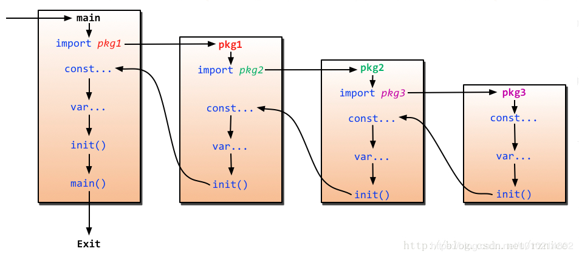

# 1.7 go package
> go语言中每个文件都必须要有一个包。使用`package`声明。

## 1、如何导入外部包或自定义包
> 使用`import`关键字导入内部包直接写具体的包名即可。导入自定义包时，以`src`为根目录导入。

     |-- bin
     |-- pkg
     |-- src
          |-- main.go
          |-- log
              |-- log.go （log包）
          |-- net
              |-- websocket
                   |-- ws.go  (package websocket)    
      
> 如导入log包则需要这么导入：`import log` 
导入websocket包：`import net/websocket`；`从src目录开始写路径`    
## 1、`import`3种导入包方式
- a、正常导入。使用包中的函数`包名.函数名(...args)`

        import (
        	"fmt"
        	"os"
        )

- b、使用别名
  
        import (
          f	    "fmt" //给fmt起别名f，使用时用 f.函数名()
          io	"os"
        )
        

- c、仅调用包的init函数(包括常量变量初始化)，匿名导入
> 有些时候是只需要调用包的init函数，而不需要调用其他方法。导入包而不使用go会报错，可以使用匿名导入避免。

       import (
         _ "github.com/go-sql-driver/mysql"
       )
       
## 2、Go代码执行流程
> main包的执行流程： const常量定义 --》 var变量定义 --》init函数 --》main函数 。如果有导入其他包，则导入包的执行顺序为：const -> var -> init

           