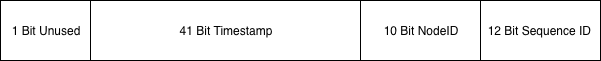
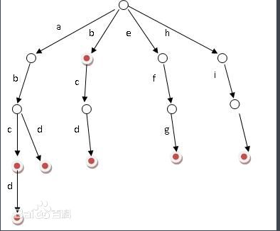

# 常见工具原理以及使用

## 1、全局唯一ID生成
> 常见算法，UUID，tweet snowflake算法

- A、UUID
> `uuid`是32位字符串，全局唯一，随机生成

- B、`tweet snowflake` 64位整数

     
     41位时间戳 + 10位节点ID + 12位序列号

## 2、`trie字典树`过滤敏感词
> 又称单词查找树，Trie树，是一种树形结构，是一种哈希树的变种。
典型应用是用于统计，排序和保存大量的字符串（但不仅限于字符串），所以经常被搜索引擎系统用于文本词频统计。
它的优点是：`利用字符串的公共前缀来减少查询时间，最大限度地减少无谓的字符串比较，查询效率比哈希树高。`

-  A：特性
   
   
     1、根节点root不包含数据节点，不包含字符
     2、从根节点开始到某一个结束的节点，中间的节点连接起来构成一个字符串
     3、每个节点的子节点包含的字符都不相同

显然面对大量文本和大量敏感词，利用字典树过滤敏感词是明智而有效的，可以大量的减少重复的抖动，从而降低时间复杂度

- B：算法逻辑

 
     插入节点逻辑：
     1、首先构造根节点，每个节点可能拥有多个子节点
     2、插入字符串时，先按字符切割，从根节点开始寻找要插入的位置
     3、如果是第一次插入，那么新建节点Node，否则继续往下查找
     4、直到插入到最后一个字符时，标识该字符为结尾字符
     
     查找逻辑：
     1、先载入词库，构成字典树
     2、切割要替换的字符串为字符数组
     3、遍历字符数组
     4、从根节点开始查找，如果查找到节点，则继续往下查找；无则重置节点，继续从根节点查找