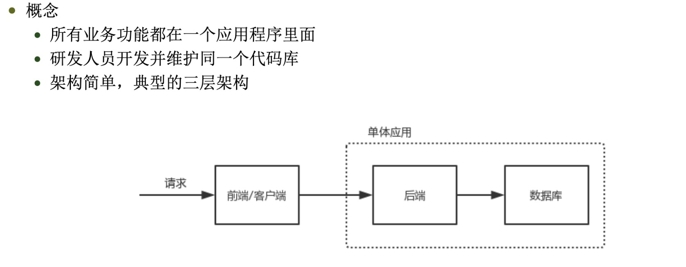

# 微服务
> 

## 1、概念

- 单体应用
   
       
      1、所有业务代码都在一个应用程序里面（功能都在同一个系统里面，耦合度高）
      2、开发人员共同维护同一个代码库
      3、架构简单，典型3层结构
      

     
    横向扩展：单体应用多份部署
    
    
       
                     
                     
- 微服务
    
    
    微服务就是微小的服务或应用，如linux的各种工具，awk，ls等
    基本原理：让每个服务专注做好一件事情
    每个服务是单独部署的，互相独立
    
    
    
    优势：
      1、迭代周期短，极大提升开发效率
      2、独立部署，独立开发
      3、可伸缩性好，能够针对指定的服务进行伸缩
      4、故障隔离，不会相互影响
      
    缺点：
      1、复杂度增加，一个请求往往要经过多个服务，请求链路长
      2、监控和定位问题难
      3、服务管理复杂  

     微服务落地关键因素：
       1、微服务框架研发和维护
       2、打包、版本管理、上线平台支持
       3、硬件层支持，比如容器和容器调度
       4、服务治理平台支持，比如分布式链路追踪和监控
       5、测试自动化支持，比如上线前自动测试所有test case
       
      组织架构：
        1、微服务研发团队
        2、私有云研发团队
        3、测试平台研发团队
         
       
## 2、微服务架构
