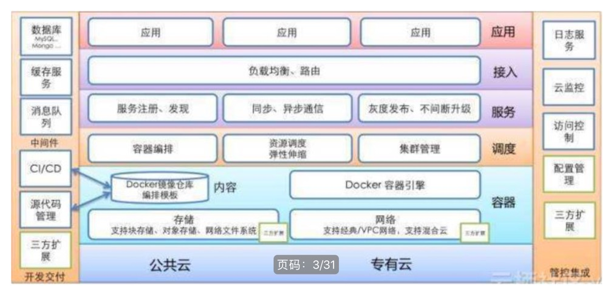
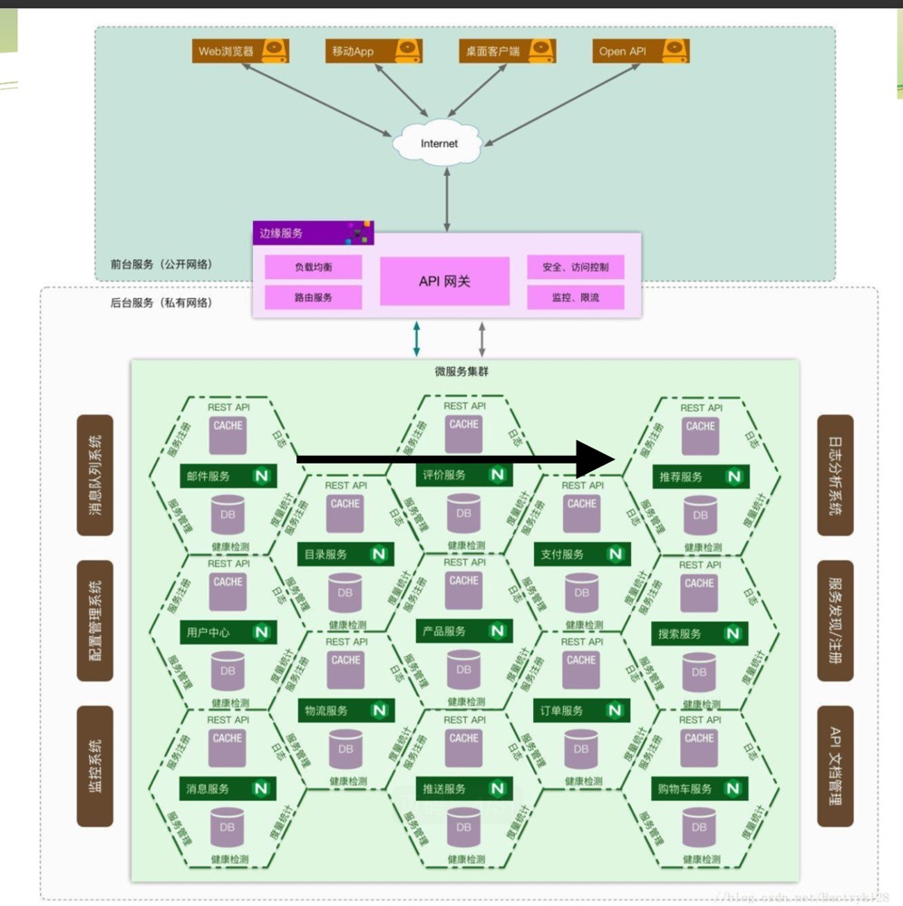

# 微服务
> 

## 1、概念

- 单体应用
   
       
      1、所有业务代码都在一个应用程序里面（功能都在同一个系统里面，耦合度高）
      2、开发人员共同维护同一个代码库
      3、架构简单，典型3层结构
      

     
    横向扩展：单体应用多份部署
    
    
       
                     
                     
- 微服务
    
    
    微服务就是微小的服务或应用，如linux的各种工具，awk，ls等
    基本原理：让每个服务专注做好一件事情
    每个服务是单独部署的，互相独立
    
    
    
    优势：
      1、迭代周期短，极大提升开发效率
      2、独立部署，独立开发
      3、可伸缩性好，能够针对指定的服务进行伸缩
      4、故障隔离，不会相互影响
      
    缺点：
      1、复杂度增加，一个请求往往要经过多个服务，请求链路长
      2、监控和定位问题难
      3、服务管理复杂  

     微服务落地关键因素：
       1、微服务框架研发和维护
       2、打包、版本管理、上线平台支持
       3、硬件层支持，比如容器和容器调度
       4、服务治理平台支持，比如分布式链路追踪和监控
       5、测试自动化支持，比如上线前自动测试所有test case
       
      组织架构：
        1、微服务研发团队
        2、私有云研发团队
        3、测试平台研发团队
         
       
## 2、微服务架构

- 1）整体架构

      硬件来看：
           公有云或私有云 -》 
           docker容器引擎、存储、网络等 -》 
           容器编排、调度（如k8s）-》
           -》 服务注册、发现、同步异步通信、灰度发布和不间断升级
           -》 应用
            
             
      
      程序架构：
      
          cache和db组成一个服务 -》 微服务集群 -》 API网关 -》 客户端
          
          
         

- 2) `raft`协议
> 分布式一致性协议。所有写入操作从都是leader节点写入。正常运行的集群是只有leader节点和follower节点.通过心跳机制来触发选举。
raft协议是通过日志复制来保持同步的。不是同步最终结果，而是同步操作，每个节点通过复制状态机执行相同操作达到最终的一致性。
      
      工作机制： 
         1、leader选举
         2、日志复制
         3、安全性
      

      raft协议角色：
          follwer节点：从节点
          candidate候选者节点：当集群不正常时，才会有候选者节点，候选成为leader节点
          leader节点： 主节点，所有数据从leader节点写入
           
       任期term：
          时间是分成一个个term任期，每个任期包含选举时间+正常服务时间
          当leader不正常时，就会触发新的一轮选举，此时开始了新的term任期
          
       leader选举过程：
           1、节点启动时，每个节点都知道其余节点的地址（比如创建redis cluster时，是要写上节点的ip和端口）
           2、所有以follower角色启动，每个节点都启动选举定时器，时间随机100~300ms，term为0
           3、follower节点超时之后没收到leader的心跳，此时会变成候选者，term++，然后为自己投一票，最后向其他节点发送rpc请求投票 （requestVote），并启动新的定时器
           4、其他节点如果收到了requestVote或appendEntries时，此时节点不会变成候选者，每个节点只能投一次票，采用先到先得的策略投票。   
           5、候选者在定时器超时之前收到了其他节点发来的 appendEntries 时，此时节点会转变成follower角色，并结束选举
           6、候选者在定时器超时之前得到了超过一半的节点同意，则会变成leader节点，同时向其他节点发送 appendEntries，告知自己已经成为了leader 
           7、节点如果在启动时就收到了leader的心跳，那么直接成为follower
           8、如果一轮下来没有一个节点的投票超过半数，则会重新选举。term++，定时器随机设置。
           
        投票的限制条件：
          1、如果请求投票的节点的term小于当前节点的term，那么直接拒绝投票
          2、如果请求投票的节点term相同，但日志index小于当前节点的index，也会拒绝投票  
          
          
          
          
        日志复制：
          1、Client向Leader提交指令(如:SET 5)，Leader收到命令后，将命令追加到本地日志中。
          此时，这个命令处于“uncomitted”状态，复制状态机不会执行该命令。
          
          2、Leader将命令(SET 5)并发复制给其他节点，并等待其他其他节点将命令写入到日志中，如果此时有些节点失败或者比较慢，
          Leader节点会一直重试，直到所有节点都保存了命令到日志中。之后Leader节点就提交命令(即被状态机执行命令，这里是:SET 5)，并将结果返回给 Client节点  
          
          3、Leader节点在提交命令后，下一次的心跳包中就带有通知其他节点提交命令的消息，其他节点 收到Leader的消息后，就将命令应用到状态机中(State Machine)，最终每个节点的日志都 保持了一致性。